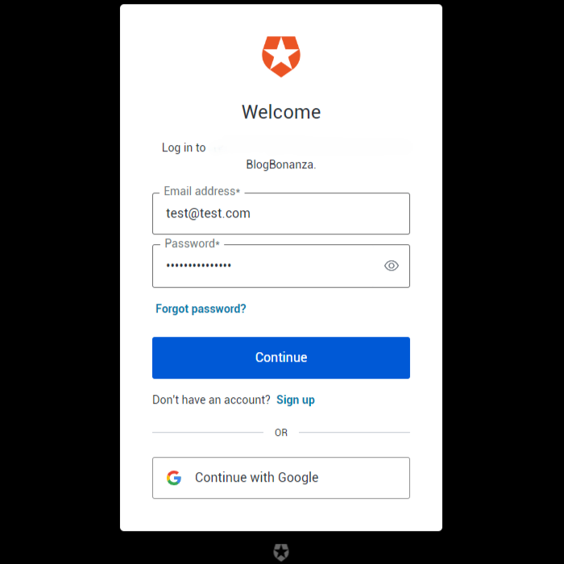

# Blog Bonanza ⭐

Blog Bonanza is a learning project primarily focused on exploring the integration of Auth0 into a Next.js application, styled with Tailwind CSS. 

This project's main objective was to understand and implement security measures using Auth0, which has successfully been achieved.  

This knowledge can now be applied to future development projects with authentication and authorization requirements. 

Potential future enhancements could include integrating an LLM API to auto-generate blog posts on requested topics, saving AI-generated content to a database, and implementing a payment platform to enable users to purchase more AI API tokens to generate even more blog posts. 

## Dependencies

- Auth0
- Font Awesome
- Next.js
- Tailwind CSS

## Installation

- Fork this repository to your own GitHub account.
- Clone your fork onto your local device.
- Install all dependencies using the `npm i` (or `npm install`) command.
- Create a new `.env.local` file containing your Auth0 account credentials, using the `.env.local.sample` file for guidance
- Start the web server using the `npm run dev` command.
- Navigate to [http://localhost:3000](http://localhost:3000/) in your browser.
- Click the green `Get Started` button
- Follow the Auth0 login window prompts to register and login

## Thanks and Acknowledgements

- Icons by [Font Awesome](https://fontawesome.com/)
- Background Image by [Alexander Grey](https://www.pexels.com/photo/pink-bokeh-lights-1560575/)